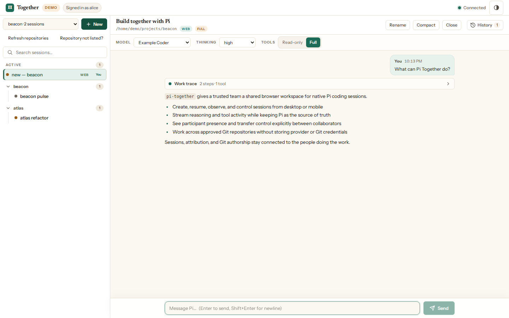
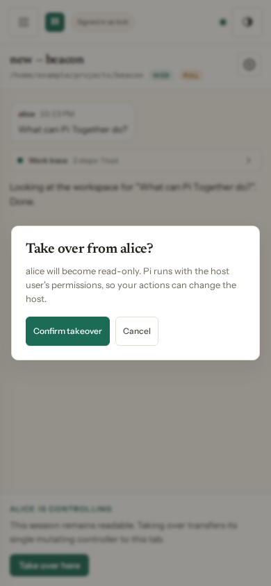

# Pi Together

Pi Together is a self-hosted, multiplayer, browser-based companion for the [Pi coding agent](https://github.com/earendil-works/pi). It lets a trusted and authenticated group create, resume, observe, and control native Pi sessions from desktop or mobile.

Pi remains the source of truth for models, provider authentication, settings, tools, extensions, workspaces, and native JSONL sessions. Pi Together does not keep a transcript database, collect provider credentials, or edit Pi session files directly.

Pi Together is an independent community project. It is not affiliated with, endorsed by, or sponsored by Pi or its maintainers.

<p align="center">
  <a href="docs/images/pi-together-dashboard.png">
    
  </a>
</p>
<p align="center"><sub>Desktop dashboard with synthetic demo identities, repositories, and conversation content.</sub></p>

## Before you install

> **Pi Together is a control surface, not a sandbox.** An authorized collaborator can ask Pi to run tools with the service user's host permissions. Use one installation only for people who fully trust one another. Use separate hosts or VMs for mutually untrusted groups.

Every allowed collaborator can view and control sessions for every eligible Git repository beneath the shared folders you approve. GitHub repository membership is not checked. Pi Together does not clone repositories, invoke `gh`, store Git credentials, or create per-user repository scopes.

A managed extension blocks common catastrophic Bash deletions of `/`, home-level anchors, approved roots, active worktrees, and `.git`. This is defense in depth, not operating-system confinement; other interpreters or binaries can bypass it.

See the [threat model](docs/threat-model.md), [deployment security contract](docs/deployment-security.md), and [privacy documentation](docs/privacy.md).

## Features

- Native Pi session discovery, creation, resume, rename, compact, close, and streaming.
- Prompts, steering, queued follow-ups, abort, thinking levels, models, and read-only/full tools.
- GitHub-authenticated collaboration through Tailscale Funnel, including participant presence and explicit controller takeover.
- Signed durable web attribution and controller history in native Pi custom entries.
- Per-turn Git authorship for normal managed `git commit` commands, with Pi Together as committer and the active Pi model in an `Agent` trailer.
- Bounded repository discovery beneath owner-approved shared folders, including linked-worktree validation.
- Guided installation, diagnostics, allowlist/workspace administration, signed upgrades, recovery, and inventory-owned uninstall.
- Release checksums, SBOM, notices, and third-party license inventory.

<p align="center">
  <a href="docs/images/pi-together-collaboration-takeover.png">
    
  </a>
</p>
<p align="center"><sub>Mutating control transfers only after an explicit takeover confirmation. Synthetic demo data shown.</sub></p>

## Supported environment

Pi Together 0.1.0 supports:

- Ubuntu 24.04 on amd64 (the tested and supported 0.1.x platform);
- Node.js 22.19 or newer;
- Pi `>=0.82.0 <0.83.0` installed for the same non-root user;
- at least one provider/model configured in Pi.

Other modern systemd-based Linux distributions may work but are untested and unsupported in 0.1.x. Arm64 and Own Domain deployment are not supported. Supported access modes are:

- **Easy Sharing:** GitHub-authenticated multiplayer over Tailscale Funnel (an upstream beta service with separate terms and availability limits).
- **Local:** single-user loopback access, optionally through a trusted SSH tunnel. Local mode is not multiplayer and uses one local identity.

## Install

Install Pi as your normal user if needed:

```bash
npm install --global --prefix "$HOME/.local" --ignore-scripts @earendil-works/pi-coding-agent@0.82
export PATH="$HOME/.local/bin:$PATH"
pi
```

In Pi, run `/login` and use `/model` to verify that a model is available. Never use `sudo npm`.

Then launch guided onboarding:

```bash
npx --yes pi-together
```

The wizard:

1. verifies Pi and its configured models;
2. explains the host-permission trust boundary;
3. selects Local or Easy Sharing access;
4. selects owner-approved shared folders;
5. displays a concise installation summary;
6. enters the narrow sudo boundary only after **Install now**.

Easy Sharing requires a manually created GitHub OAuth App. The wizard displays the exact homepage and callback URLs and never requests GitHub management credentials. It can prepare the pinned Tailscale prerequisite only after separate terms acceptance, then waits for any required tailnet approval and sustained public-route verification before reporting success.

An empty shared folder may remain a repository container or be explicitly initialized as a local `main` Git repository. Pi Together never creates a remote or commit.

## Daily operation

```bash
pi-together manage
pi-together status [--json]
pi-together doctor [--json]
pi-together logs --component app|oauth2-proxy|nginx|certbot [--follow]
pi-together users list|add|remove
pi-together workspaces list|detect|configure
pi-together share enable|disable|status|verify
pi-together recover
pi-together uninstall [--purge-config]
```

Creating a browser session refreshes Pi's available-model catalog, so a provider added later through `pi` → `/login` appears without restarting Pi Together. Existing sessions are not silently switched to another model.

Uninstall preserves Pi sessions, Pi configuration, provider authentication, workspaces, unrelated integrations, and backups. Pi Together configuration is preserved unless `--purge-config` is supplied.

See the [operations guide](docs/operations.md) for administration, recovery, and lifecycle details.

## Signed upgrades

Download the release bundle attached to the target GitHub release, verify its published checksum, and unpack it into a user-owned directory. Review without mutation:

```bash
pi-together upgrade latest --bundle ./release-bundle --dry-run
```

Apply after reviewing the exact version, source tag/commit, and signing key:

```bash
pi-together upgrade latest --bundle ./release-bundle
```

Pi Together accepts only a newer stable version signed by the pinned release key. Activation uses a new immutable release directory, verifies service health, and restores the previous release on failure.

## Development

```bash
npm ci --include=dev --ignore-scripts
npm run typecheck
npm test
npm run build
PI_TOGETHER_ADAPTER=fake npm start
```

Open `http://127.0.0.1:43117`. Default tests use synthetic adapters and do not call paid model providers.

Before review, run:

```bash
npm run typecheck
npm test
npm run test:e2e
npm run build
npm run test:package
npm run safety:scan
npm run safety:artifacts
npm run safety:package
npm run audit:ci
```

Native deployment, full-stack, and ACME tests have additional pinned binary requirements documented in [CONTRIBUTING.md](CONTRIBUTING.md).

## Project documentation

- [Operations](docs/operations.md)
- [Architecture](docs/architecture.md)
- [Security policy](SECURITY.md)
- [Threat model](docs/threat-model.md)
- [Deployment security](docs/deployment-security.md)
- [Privacy](docs/privacy.md)
- [Support](SUPPORT.md)
- [Contributing](CONTRIBUTING.md)
- [Licensing](docs/licensing.md)
- [Changelog](CHANGELOG.md)

## License

Pi Together is licensed under the [MIT License](LICENSE). Copyright © 2026 Tim Xu. Third-party components retain their own licenses; see [Licensing](docs/licensing.md) and the generated release notices.
